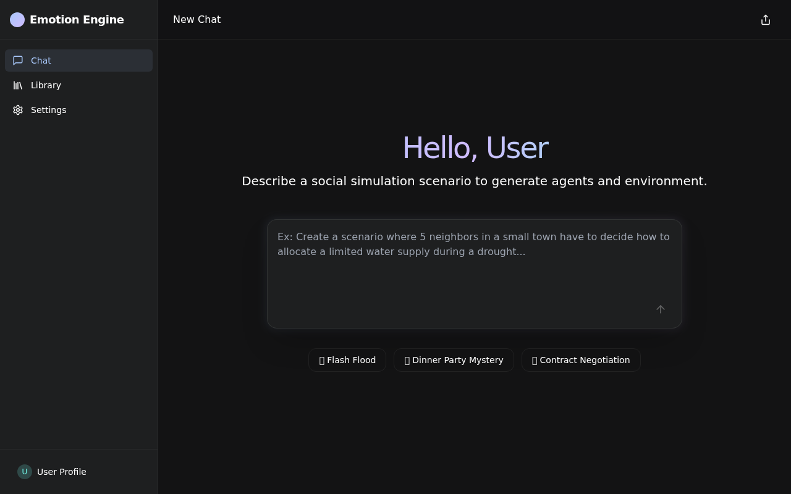
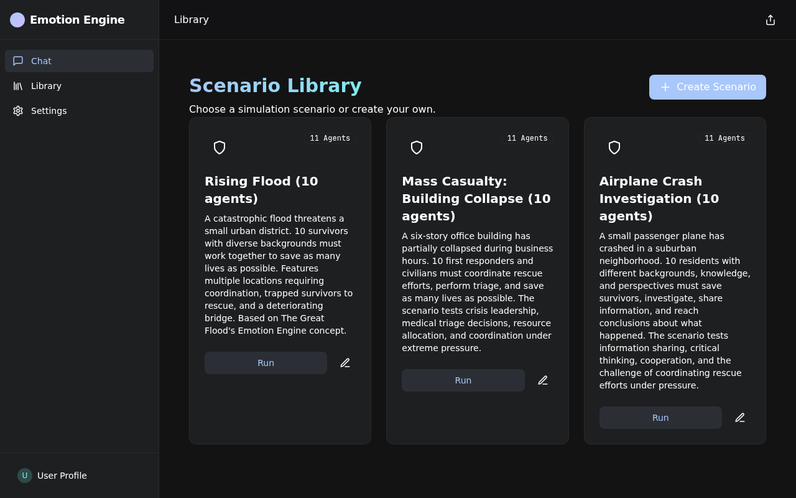
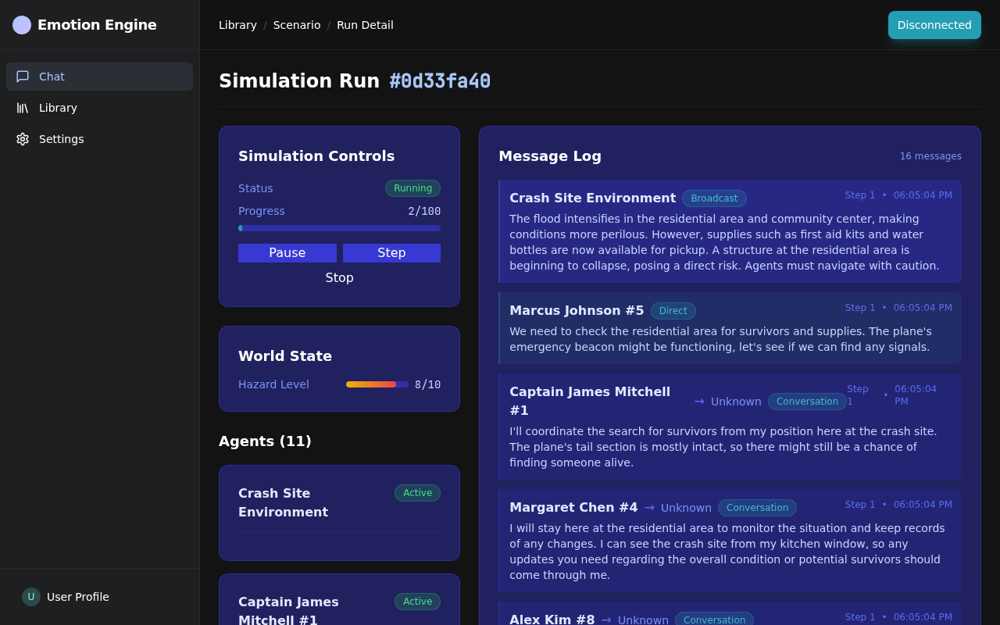
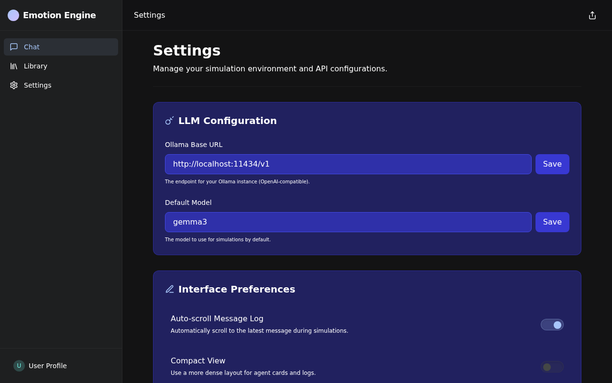

# EmotionSim - Multi-Agent Simulation System

A local-first multi-agent simulation system inspired by Netflix's "The Great Flood" Emotion Engine concept. Run AI agent swarms in parallel disaster simulations with diverse human personas, and analyze their cooperation and decision-making.


## Features

- **Agent Roleplay**: Agents have rich personas with demographics, Big Five personality traits, and behavioral modifiers
- **Discrete Simulation**: Step-by-step simulation with configurable tick rates
- **Real-time Dashboard**: SvelteKit frontend with WebSocket updates
- **Flexible LLM Backend**: Uses Ollama by default, designed for easy Claude integration
- **Message Bus**: Direct, room-based, and broadcast messaging between agents
- **Evaluation System**: AI-powered evaluation of runs with scores and narrative analysis

## Architecture

```
┌─────────────────────────────────────────────────────────────┐
│                    SvelteKit Dashboard                       │
│  ┌───────────┐  ┌───────────┐  ┌──────────────────────┐    │
│  │ Scenarios │  │ Run View  │  │  Agent Chat Logs     │    │
│  └───────────┘  └───────────┘  └──────────────────────┘    │
└────────────────────────┬────────────────────────────────────┘
                         │ WebSocket / REST
┌────────────────────────┴────────────────────────────────────┐
│                    FastAPI Backend                           │
│  ┌──────────┐  ┌─────────────────┐  ┌─────────────────┐    │
│  │   API    │  │ SimulationEngine │  │   LLM Router   │    │
│  └──────────┘  └─────────────────┘  └─────────────────┘    │
│        │               │                     │              │
│  ┌─────┴─────┐  ┌─────┴─────┐        ┌─────┴─────┐        │
│  │  SQLite   │  │  Agents   │        │  Ollama   │        │
│  └───────────┘  └───────────┘        └───────────┘        │
└─────────────────────────────────────────────────────────────┘
```

## Quick Start

### Prerequisites

- Python 3.11+
- Node.js 20+
- [Ollama](https://ollama.ai/) with a model installed (e.g., `ollama pull gemma3`)

### Development Setup

1. **Start Ollama** (if not already running):
   ```bash
   ollama serve
   ```

2. **Backend Setup**:
   ```bash
   cd backend
   python -m venv venv
   source venv/bin/activate  # On Windows: venv\Scripts\activate
   pip install -r requirements.txt
   
   # Run the server (database initializes automatically)
   python -m app.main
   ```

### 🚀 Auto Mode (Recommended)

Run the entire stack (Frontend + Backend) with a single command:

```bash
cd frontend
npm run dev
```

This will:
1. Start the Python backend (API + Simulation Engine)
2. Start the SvelteKit frontend dashboard
3. Launch the browser automatically


3. **Frontend Setup**:
   ```bash
   cd frontend
   npm install
   npm run dev
   ```

4. **Access the Dashboard**: Open http://localhost:5173

### Docker Setup

```bash
# Make sure Ollama is running on the host
ollama serve

# Build and start containers
docker-compose up --build
```

Access the dashboard at http://localhost:3000

## Project Structure

```
emotion-engine/
├── backend/
│   ├── app/
│   │   ├── agents/         # Agent classes (Human, Environment, Designer, Evaluator)
│   │   ├── api/            # FastAPI routes and WebSocket
│   │   ├── llm/            # LLM client abstraction
│   │   ├── models/         # SQLAlchemy database models
│   │   ├── schemas/        # Pydantic schemas
│   │   ├── scenarios/      # Pre-built scenarios (Rising Flood)
│   │   └── simulation/     # Simulation engine and message bus
│   └── tests/              # Pytest tests
├── frontend/
│   ├── src/
│   │   ├── lib/            # Components, stores, API client
│   │   └── routes/         # SvelteKit pages
│   └── static/
└── docker-compose.yml
```

## Example Scenario: Rising Flood

The included "Rising Flood" scenario features 8 diverse human agents:

| Character | Age | Occupation | Key Traits |
|-----------|-----|------------|------------|
| Dr. Sarah Chen | 42 | ER Doctor | High empathy, calm under pressure |
| Marcus Thompson | 28 | Construction Worker | Risk-taker, physically strong |
| Elena Rodriguez | 67 | Retired Teacher | Wise, limited mobility |
| Jake Miller | 16 | Student | Impulsive, athletic swimmer |
| Aisha Patel | 35 | Software Engineer | Analytical, introverted |
| Bobby Williams | 55 | Retired Firefighter | Natural leader, some injuries |
| Mei-Lin Wu | 8 | Child | Scared, needs protection |
| Victor Kozlov | 45 | Unemployed | Bitter, unpredictable |

## CLI Monitor Tool

EmotionSim includes a powerful CLI for monitoring and running simulations directly from your terminal with beautiful real-time visualizations.

### Installation

```bash
cd backend
pip install -e .  # Install CLI entry point
```

### Commands

**Run Simulation (Standalone Mode)**
```bash
emotionsim run --scenario "Rising Flood" --max-steps 50 --seed 42
emotionsim run --scenario "Rising Flood" --simple  # Log output
```

**Monitor Running Simulation (Client Mode)**
```bash
emotionsim monitor --run-id <uuid>
emotionsim monitor --run-id <uuid> --simple
```

**Scenario Management**
```bash
emotionsim scenarios                    # List scenarios
emotionsim scenarios --create-builtin   # Create built-in scenarios
```

**Interactive Mode**
```bash
emotionsim interactive  # Wizard to configure and run
```

**Server Status**
```bash
emotionsim status  # Check if backend is running
```

### CLI Features

- **Rich UI Mode**: Live-updating panels with world state, agent status, conversations, and event log
- **Simple Mode**: Clean streaming logs for piping/grepping
- **Dual Modes**: Standalone (no server) or Client (WebSocket to backend)
- **Real-time Monitoring**: See all agent conversations, movements, and events as they happen


*Real-time CLI monitor showing agent interactions, world state, and event log*

## Screenshots

### CLI Monitor

The CLI provides a rich terminal interface with live-updating panels:


### Frontend Dashboard

The web-based dashboard provides a visual interface for managing and monitoring simulations:


*Main dashboard showing active simulations and scenarios*


*Scenario management and configuration*


*Detailed view of a running simulation with agent interactions*


*Application settings and configuration*

## API Endpoints

### Scenarios
- `GET /api/scenarios/` - List all scenarios
- `POST /api/scenarios/` - Create a new scenario
- `GET /api/scenarios/{id}` - Get scenario details
- `PUT /api/scenarios/{id}` - Update a scenario
- `DELETE /api/scenarios/{id}` - Delete a scenario

### Runs
- `GET /api/runs/` - List all runs
- `POST /api/runs/` - Create a new run
- `GET /api/runs/{id}` - Get run details
- `POST /api/runs/{id}/control` - Control run (start/pause/resume/stop/step)
- `GET /api/runs/{id}/agents` - Get agents in a run
- `GET /api/runs/{id}/messages` - Get messages from a run

### WebSocket
- `WS /api/ws/{run_id}` - Real-time run updates

## Agent Types

### HumanAgent
Roleplays as a person with:
- **Demographics**: Name, age, sex, occupation
- **Big Five Traits**: Openness, Conscientiousness, Extraversion, Agreeableness, Neuroticism
- **Behavioral Modifiers**: Risk tolerance, empathy, leadership
- **Dynamic State**: Stress level, health, inventory, location

### EnvironmentAgent
Controls the world state:
- Hazard levels and progression
- Resource spawning
- Environmental events

### DesignerAgent
Meta-orchestrator that:
- Monitors agent behaviors
- Injects events for drama
- Evaluates emergent patterns

### EvaluationAgent
Post-run analysis:
- Scores cooperation, ethics, strategy
- Generates narrative evaluation
- Identifies highlights and concerns

## Configuration

### Environment Variables

Copy `backend/.env.example` to `backend/.env` and configure:

```env
# LLM Provider
OLLAMA_BASE_URL=http://localhost:11434/v1
OLLAMA_DEFAULT_MODEL=gemma3

# Alternative models: phi3, llama3.2:3b, mistral:7b, qwen3:0.6b, etc.
# For Claude (future)
ANTHROPIC_API_KEY=your-key-here
```

## Running Tests

```bash
cd backend
pytest
```

## License

MIT License - see LICENSE file for details.

## Acknowledgments

Inspired by the Emotion Engine concept from Netflix's "The Great Flood" - where AI agents run through thousands of disaster simulations to develop emotional intelligence and moral reasoning.
