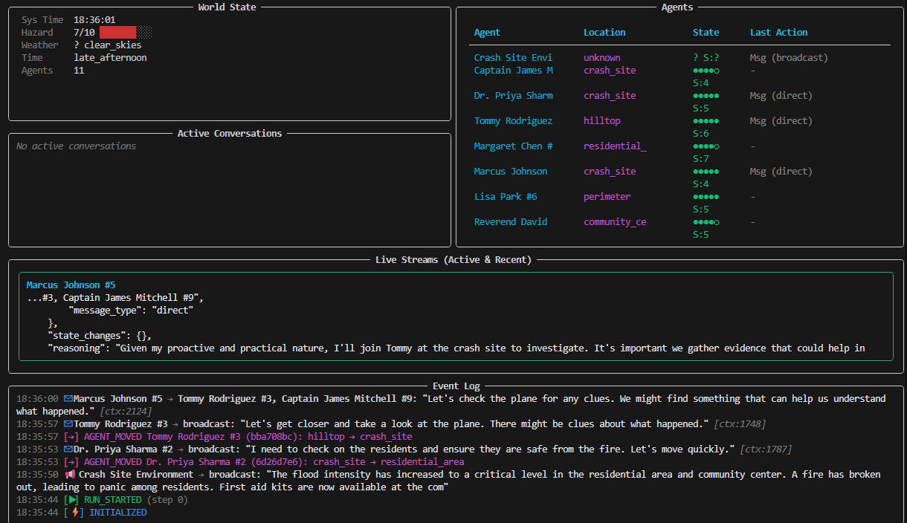

# EmotionSim - Multi-Agent Simulation System


> **"The Great Flood" in your terminal.**
> A local-first multi-agent simulation system for running complex disaster scenarios with diverse human personas.



## Overview

EmotionSim is a research-grade simulation engine designed to analyze emergent cooperative behaviors in AI agent swarms. It combines a robust discrete-event simulation kernel with rich LLM-driven agent personas to create high-fidelity social simulations.

## Key Features

- **🧠 Deep Agent Roleplay**: Agents have rich personas with demographics, Big Five personality traits, and dynamic emotional states.
- **⚡ Real-time CLI Monitor**: A beautiful, terminal-based dashboard for watching your simulation unfold in real-time.
- **🔄 Discrete Event Simulation**: Deterministic step-by-step execution for reproducible research.
- **📡 Modern Architecture**: FastAPI backend + SvelteKit frontend, connected via WebSockets.
- **🔌 LLM Agnostic**: Built for Ollama (local) but extensible to Claude/GPT-4.
- **📊 Auto-Evaluation**: Built-in evaluator agents that analyze run performance and narrative arcs.

## Quick Start

The fastest way to get started is using the CLI tool.

### 1. Prerequisites

- Python 3.11+
- [Ollama](https://ollama.ai/) running locally (e.g., `ollama serve`)
- An LLM model pulled (e.g., `ollama pull gemma2`)

### 2. Installation

```bash
cd backend
pip install -e .
```

### 3. Run a Simulation

The `emotionsim` CLI is the main interface. Start a simulation immediately:

```bash
# Run the built-in "Rising Flood" scenario
emotionsim run --scenario "Rising Flood"
```

This launches the **Interactive CLI Monitor**, where you can watch:
- 🌍 **World State**: Water levels, temperature, time.
- 👥 **Agents**: Real-time health, stress, and current actions.
- 💬 **Live Stream**: The raw thought process of the LLM agents.

### Other Running Modes

**Automated Batch Testing**
Run multiple simulations in sequence without supervision:
```bash
emotionsim auto --count 5
```

**Full Client-Server Mode**
If you prefer the web dashboard:
```bash
# Start the full stack
cd frontend
npm run dev
```

This will:
1. Start the Python backend (API + Simulation Engine)
2. Start the SvelteKit frontend dashboard
3. Launch the browser automatically

## Architecture

```
┌─────────────────────────────────────────────────────────────┐
│                    SvelteKit Dashboard                       │
│  ┌───────────┐  ┌───────────┐  ┌──────────────────────┐    │
│  │ Scenarios │  │ Run View  │  │  Agent Chat Logs     │    │
│  └───────────┘  └───────────┘  └──────────────────────┘    │
└────────────────────────┬────────────────────────────────────┘
                         │ WebSocket / REST
┌────────────────────────┴────────────────────────────────────┐
│                    FastAPI Backend                           │
│  ┌──────────┐  ┌─────────────────┐  ┌─────────────────┐    │
│  │   API    │  │ SimulationEngine │  │   LLM Router   │    │
│  └──────────┘  └─────────────────┘  └─────────────────┘    │
│        │               │                     │              │
│  ┌─────┴─────┐  ┌─────┴─────┐        ┌─────┴─────┐        │
│  │  SQLite   │  │  Agents   │        │  Ollama   │        │
│  └───────────┘  └───────────┘        └───────────┘        │
└─────────────────────────────────────────────────────────────┘
```

## Project Structure

```
emotion-engine/
├── backend/
│   ├── app/
│   │   ├── agents/         # Agent classes (Human, Environment, Designer, Evaluator)
│   │   ├── api/            # FastAPI routes and WebSocket
│   │   ├── llm/            # LLM client abstraction
│   │   ├── models/         # SQLAlchemy database models
│   │   ├── schemas/        # Pydantic schemas
│   │   ├── scenarios/      # Pre-built scenarios (Rising Flood)
│   │   └── simulation/     # Simulation engine and message bus
│   └── tests/              # Pytest tests
├── frontend/
│   ├── src/
│   │   ├── lib/            # Components, stores, API client
│   │   └── routes/         # SvelteKit pages
│   └── static/
└── docker-compose.yml
```

## Example Scenario: Rising Flood

The included "Rising Flood" scenario features 8 diverse human agents:

| Character | Age | Occupation | Key Traits |
|-----------|-----|------------|------------|
| Dr. Sarah Chen | 42 | ER Doctor | High empathy, calm under pressure |
| Marcus Thompson | 28 | Construction Worker | Risk-taker, physically strong |
| Elena Rodriguez | 67 | Retired Teacher | Wise, limited mobility |
| Jake Miller | 16 | Student | Impulsive, athletic swimmer |
| Aisha Patel | 35 | Software Engineer | Analytical, introverted |
| Bobby Williams | 55 | Retired Firefighter | Natural leader, some injuries |
| Mei-Lin Wu | 8 | Child | Scared, needs protection |
| Victor Kozlov | 45 | Unemployed | Bitter, unpredictable |

## CLI Monitor Tool

### Installation

```bash
cd backend
pip install -e .  # Install CLI entry point
```

### Commands

**Run Simulation (Standalone Mode)**
```bash
emotionsim run --scenario "Rising Flood" --max-steps 50 --seed 42
emotionsim run --scenario "Rising Flood" --simple  # Log output
```

**Monitor Running Simulation (Client Mode)**
```bash
emotionsim monitor --run-id <uuid>
emotionsim monitor --run-id <uuid> --simple
```

**Scenario Management**
```bash
emotionsim scenarios                    # List scenarios
emotionsim scenarios --create-builtin   # Create built-in scenarios
```

**Interactive Mode**
```bash
emotionsim interactive  # Wizard to configure and run
```

**Server Status**
```bash
emotionsim status  # Check if backend is running
```

### CLI Features

- **Rich UI Mode**: Live-updating panels with world state, agent status, conversations, and event log
- **Simple Mode**: Clean streaming logs for piping/grepping
- **Dual Modes**: Standalone (no server) or Client (WebSocket to backend)
- **Real-time Monitoring**: See all agent conversations, movements, and events as they happen

## License

MIT License - see LICENSE file for details.

## Acknowledgments

Inspired by the Emotion Engine concept from Netflix's "The Great Flood" - where AI agents run through thousands of disaster simulations to develop emotional intelligence and moral reasoning.
