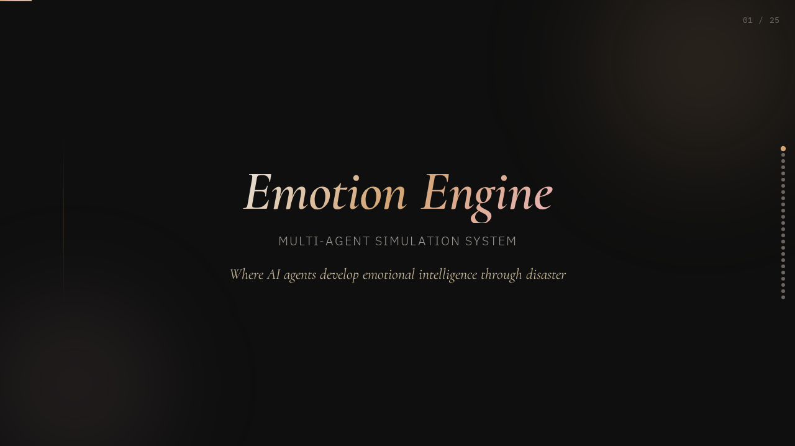
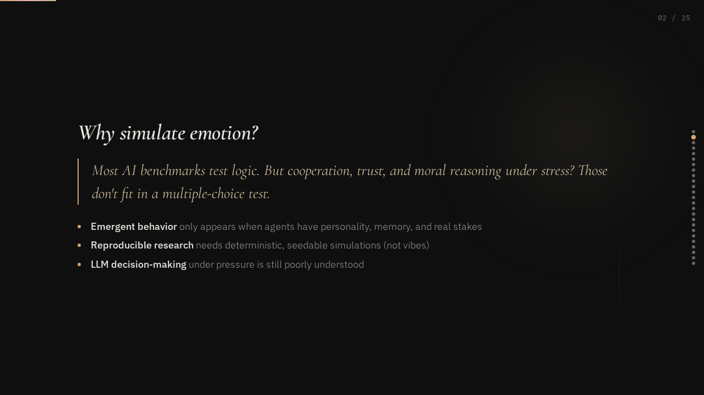
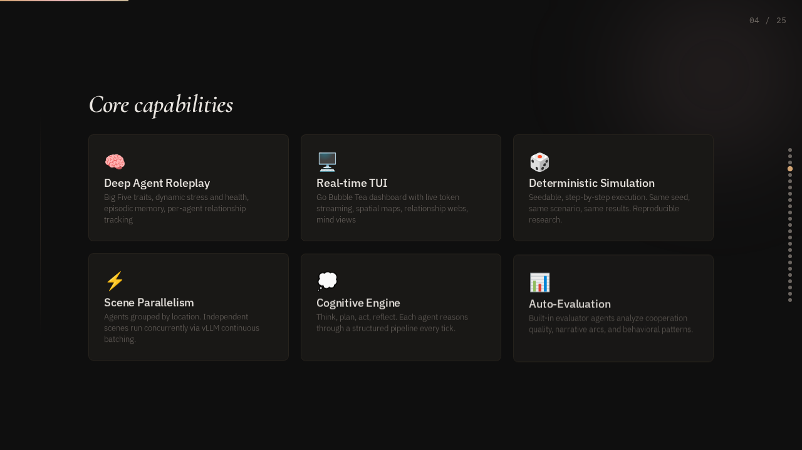
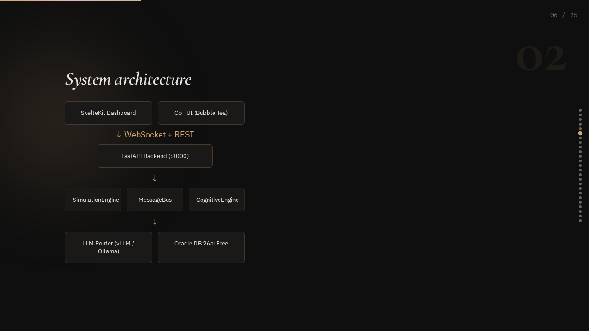
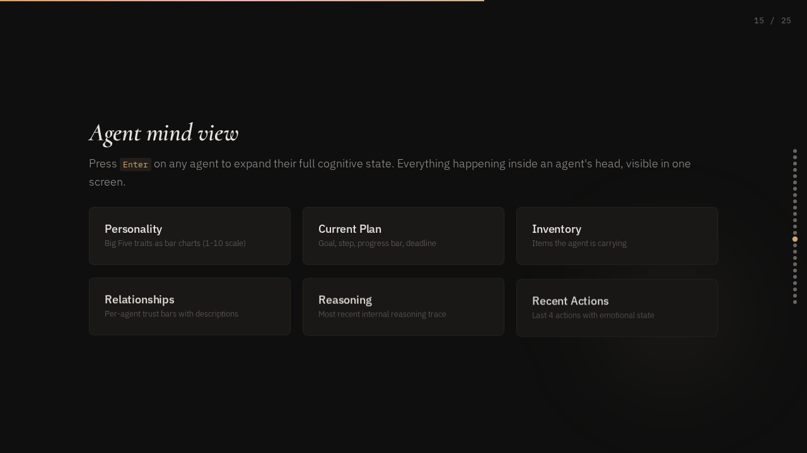
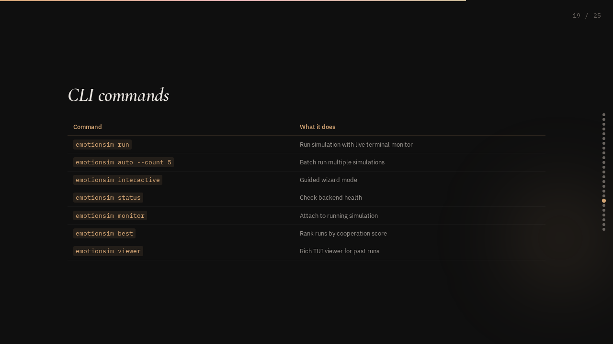

<p align="center">
  
</p>

<h1 align="center">Emotion Engine: Multi-Agent Simulation</h1>

<p align="center"><strong>A local-first multi-agent simulation engine for analyzing emergent cooperative behaviors in AI agent swarms under disaster scenarios.</strong></p>

<p align="center">
  
  
  
  
  
  
  
</p>

---

Simulates disaster scenarios with diverse LLM-driven personas that interact, make decisions, and cooperate based on Big Five personality traits and dynamic emotional states. Each agent runs a full cognitive pipeline (think, plan, act, reflect) and maintains episodic memory, relationship tracking, and inventory across a discrete-event simulation. The engine supports parallel scene processing via vLLM, a real-time Go TUI dashboard, a SvelteKit web frontend, and Oracle DB 26ai Free for persistence and cross-run analytics.

## Architecture at a Glance

<table>
  <tr>
    <td align="center"><strong>Title</strong><br></td>
    <td align="center"><strong>Overview</strong><br></td>
  </tr>
  <tr>
    <td align="center"><strong>Architecture</strong><br></td>
    <td align="center"><strong>Features</strong><br></td>
  </tr>
  <tr>
    <td align="center"><strong>Tech Stack</strong><br></td>
    <td align="center"><strong>Getting Started</strong><br></td>
  </tr>
</table>

<p align="center">
  <a href="docs/slides/presentation.html">View the full interactive presentation</a>
  &nbsp;&nbsp;|&nbsp;&nbsp;
  <a href="interactive/">Explore the Interactive Explorer</a>
</p>

## Key Features

| Feature | Description |
|---------|-------------|
| **Deep Agent Roleplay** | Big Five personality traits, dynamic stress/health, episodic memory, and relationship tracking |
| **Real-time TUI Dashboard** | Go-based terminal UI with live token streaming, spatial maps, relationship webs, negotiation theater, agent mind views, replay, and cross-run analytics |
| **Discrete Event Simulation** | Deterministic, seedable, step-by-step execution for reproducible research |
| **Scene-based Parallelism** | Agents grouped by location; independent scenes run concurrently via vLLM |
| **Cognitive Engine** | Think, Plan, Act, Reflect pipeline with intent memory |
| **Auto-Evaluation** | Built-in evaluator agents that analyze run performance and narrative arcs |
| **Modern Stack** | FastAPI + SvelteKit + Oracle DB 26ai Free + vLLM/Ollama |

## Quick Start

> **One-command install:**
> ```bash
> curl -fsSL https://raw.githubusercontent.com/jasperan/emotion-engine/main/install.sh | bash
> ```

### Backend

```bash
cd backend
pip install -e .
emotionsim run --scenario "Rising Flood" --max-steps 50 --seed 42
```

### TUI Dashboard

```bash
cd tui
make build                            # or: go build -ldflags "-s -w" -o emotionsim-tui .
./emotionsim-tui                      # auto-starts backend + vLLM if not running
./emotionsim-tui --no-backend         # connect to existing backend
./emotionsim-tui --no-vllm            # skip vLLM auto-start (use Ollama)
./emotionsim-tui --no-backend --no-vllm  # connect to all existing services
```

The TUI has 7 screens and multiple panel modes. See the [TUI Guide](#tui-guide) below for the full walkthrough.

### Web Dashboard

```bash
cd frontend
npm install                   # first time only
npm run dev                   # starts both backend + SvelteKit frontend
```

## Architecture

```
SvelteKit Dashboard / Go TUI
    |  WebSocket + REST
FastAPI Backend (:8000)
    |-- SimulationEngine (orchestrator, tick loop, scene director)
    |-- Agents: Human, Environment, Designer, Evaluator
    |-- MessageBus -> ConversationManager -> CooperationCoordinator
    |-- TrustNetwork, NegotiationManager, WorldStateDiffTracker
    \-- CognitiveEngine (think -> plan -> act -> reflect)
    |
LLM Router (vLLM :8010 primary, Ollama fallback)
    |
Oracle DB 26ai Free (runs, agents, steps, messages, scenarios)
```

### Simulation Flow

1. **Phase 1** -- Environment agents generate world events and update hazard levels
2. **Phase 2** -- Human agents process in parallel scenes (by location) or sequentially
3. **Phase 3** -- Reaction round for intra-step responses
4. **Persist** -- State snapshot saved, WebSocket events emitted, consensus check

## Built-in Scenarios

| Scenario | Agents | Description |
|----------|--------|-------------|
| Rising Flood | 10 | Ten diverse personas navigate a flooding disaster -- from an ER doctor and retired firefighter to a scared 8-year-old child |
| Sinking Cruise Ship | 12 | Passengers and crew face a maritime emergency aboard a sinking vessel |
| Airplane Crash Investigation | 10 | Survivors of a crash landing cooperate to secure the site and treat the injured |
| Mass Casualty: Building Collapse | 10 | First responders and civilians respond to a structural collapse |
| Philippines Mega-Tsunami | 12 | Coastal residents face a mega-tsunami across the Philippine archipelago |
| First Contact: Alien Signal | 12 | Scientists, military, and civilians react to confirmed extraterrestrial communication |
| Volcanic Eruption Warning | 11 | Icelanders evacuate and coordinate as a volcano erupts |
| ISS Cascade Failure | 11 | Astronauts and ground control manage cascading systems failures on the space station |
| Australian Bushfire Encirclement | 12 | Rural communities face encirclement by an Australian bushfire |

## CLI Commands

| Command | Description |
|---------|-------------|
| `emotionsim run --scenario "Rising Flood"` | Run simulation with live monitor |
| `emotionsim auto --count 5` | Batch run multiple simulations |
| `emotionsim scenarios --create-builtin` | Create built-in scenario templates |
| `emotionsim interactive` | Guided wizard mode |
| `emotionsim status` | Check backend health |
| `emotionsim monitor` | Attach to running simulation |
| `emotionsim best` | Show best runs ranked by cooperation |
| `emotionsim viewer` | Rich TUI viewer for past runs |

## TUI Guide

The Go TUI is a full-featured terminal interface for running, monitoring, and analyzing simulations. Built with [Bubble Tea](https://github.com/charmbracelet/bubbletea) and [Lipgloss](https://github.com/charmbracelet/lipgloss).

### Building

```bash
cd tui
make build                                  # or: go build -ldflags "-s -w" -o emotionsim-tui .
./emotionsim-tui                            # auto-starts backend + vLLM
./emotionsim-tui --no-backend --no-vllm     # connect to running services
./emotionsim-tui --ssh-port 2222            # serve over SSH (read-only)
```

### Screens

The TUI has 7 screens, navigated by keyboard:

| Screen | Entry | Purpose |
|--------|-------|---------|
| **Splash** | Launch | Animated banner, backend health check |
| **Scenarios** | From Splash | Browse and select scenarios |
| **Launcher** | Enter on scenario | Configure max steps, seed, inference provider |
| **Dashboard** | After launch | Live simulation monitoring |
| **History** | `h` from Scenarios | Browse past runs |
| **Replay** | Enter on completed run | Step-by-step playback with diffs |
| **Analytics** | `a` from Scenarios/History | Cross-run datalake analysis |

### Dashboard

The main monitoring screen. Left side shows up to 4 agent panes with live token streaming. Right side cycles between 4 panel modes with `Tab`.


Each agent pane shows: name, occupation, age, health (HP), stress (ST), location, current plan goal with progress, and the live token stream from the LLM.

**Panel Modes** (cycle with `Tab`):

#### Feed Mode
The default. Shows a scrollable message feed grouped by location, plus a world state panel with hazard gauge and location summary. Press `f` to filter messages: All, Speech only, Negotiations only, or Movement only.

#### Spatial Map
Live map of all locations with agent positions and travel progress.


Locations show agent count and names. Hazard zones are highlighted in red. Agents in transit show progress bars. Updates live from movement events.

#### Relationship Web
Shows trust, conflict, alliance, and pending relationships between agents.


Edges are color-coded: green for trust/alliance, red for conflict, yellow for pending negotiations. Strength bars show relationship intensity. Updates live from vouch and proposal events.

#### Negotiation Theater
Timeline of proposals, counter-proposals, and their resolution.


Each proposal shows: proposer, target, terms, and status. Responses are indented below with accept/reject/counter actions. Scrollable with `j`/`k`.

### Agent Mind View

Press `Enter` on any selected agent to expand a full-screen detail view.


Shows the agent's complete cognitive state:
- **Personality** -- Big Five traits as bar charts (1-10 scale)
- **Plan** -- Current goal, step, progress, deadline
- **Inventory** -- Items the agent is carrying
- **Relationships** -- Per-agent trust bars with descriptions
- **Last Reasoning** -- The agent's most recent internal reasoning
- **Recent Actions** -- Last 4 actions with emotional state

Press `Esc` to return. `h`/`l` cycles between agents while expanded.

### Replay Screen

For completed runs, the History screen opens Replay instead of the live dashboard. Step through the simulation frame by frame.

**Controls:**
- `left`/`right` or `h`/`l` -- step backward/forward
- `H`/`L` -- jump 5 steps
- `Space` -- auto-play (toggle)
- `+`/`-` -- adjust playback speed (250ms to 5s)
- `d` -- toggle diff view (shows what changed each step in green/yellow/red)
- `e` -- jump to evaluation (last step)

### Analytics Screen

Press `a` from Scenarios or History to open cross-run analytics. Requires `DATALAKE_ENABLED=true` in `.env`.

- Browse all runs with status indicators
- Filter by scenario with `s`
- View aggregate datalake stats
- Press `Enter` on any run to open it in Replay

### Keyboard Reference

| Key | Dashboard | Replay | Analytics |
|-----|-----------|--------|-----------|
| `Tab` | Cycle panel mode | -- | -- |
| `Enter` | Agent Mind View | -- | Open run |
| `g` | Grid/Focus toggle | -- | -- |
| `f` | Filter messages | -- | -- |
| `Space` | Pause/Resume | Play/Pause | -- |
| `s` | Stop run | -- | Cycle scenario |
| `d` | -- | Toggle diff | -- |
| `j`/`k` | Scroll feed | -- | Select run |
| `h`/`l` | Cycle agents | Step back/fwd | -- |
| `1-9` | Select agent | -- | -- |
| `q` | Back | Back | Back |
| `F1` | Help overlay | Help overlay | Help overlay |

## Configuration

Environment variables via `.env` in `backend/`:

| Variable | Default | Description |
|----------|---------|-------------|
| `LLM_BACKEND` | `vllm` | `vllm` or `ollama` (Docker defaults to `ollama`) |
| `VLLM_BASE_URL` | `http://localhost:8010` | vLLM server address |
| `VLLM_DEFAULT_MODEL` | `Qwen/Qwen3.5-4B` | Model loaded in vLLM |
| `OLLAMA_BASE_URL` | `http://localhost:11434/v1` | Ollama server address |
| `OLLAMA_DEFAULT_MODEL` | `qwen3.5:4b` | Model for Ollama inference |
| `ORACLE_DB_HOST` | `localhost` | Oracle DB host |
| `ORACLE_DB_PORT` | `1522` | Oracle DB port |
| `ORACLE_DB_USER` | `emotionsim` | DB username (dev default) |
| `DEFAULT_MAX_STEPS` | `10` | Default simulation length |
| `SCENE_MODE` | `true` | Parallel scenes by location (vLLM only) |
| `DATALAKE_ENABLED` | `true` | Enable cross-run analytics |
| `CORS_ORIGINS` | `localhost:3000,5173` | Allowed CORS origins |

## Project Structure

```
emotion-engine/
  backend/
    app/
      agents/        # Human, Environment, Designer, Evaluator
      api/           # FastAPI routes + WebSocket
      llm/           # vLLM/Ollama router, token logger
      models/        # SQLAlchemy ORM (Oracle DB)
      schemas/       # Pydantic validation
      scenarios/     # Built-in scenario templates
      simulation/    # Engine, message bus, conversations, scenes
  tui/               # Go Bubble Tea terminal dashboard
    cmd/             # CLI entry point
    internal/        # App screens, API client, components, theme
  frontend/          # SvelteKit web dashboard
  interactive/       # Interactive Explorer (Next.js)
  docs/
    slides/          # Presentation slides + HTML deck
    images/          # TUI screenshots
  assets/            # CLI and frontend screenshots
  docker-compose.yml
```

## Agent System

Each human agent maintains:

- **Persona** -- Demographics, occupation, skills, Big Five traits (immutable)
- **Dynamic State** -- Health, stress, location, inventory, relationships (mutable per step)
- **Episodic Memory** -- Significant events with emotional valence, auto-summarized
- **Relationship Tracking** -- Trust levels and sentiment per agent pair
- **Cognitive Pipeline** -- Context building, LLM call (JSON mode), action parsing, state update

Agents communicate through a structured protocol with direct, broadcast, and room-scoped channels. A coordination controller modulates communication frequency based on personality traits.

## Prerequisites

**Docker path** (one-command install): Docker + Docker Compose only.

**Manual path:**
- Python 3.11+, Go 1.24+ (for TUI), Node.js 18+ (for web dashboard)
- [vLLM](https://docs.vllm.ai/) (recommended) or [Ollama](https://ollama.ai/) for local inference
- Oracle DB 26ai Free (localhost:1522)

## License

MIT License -- see LICENSE file for details.

## Credits

Inspired by the Emotion Engine concept -- where AI agents run through disaster simulations to develop emotional intelligence and moral reasoning.

---

<div align="center">
  <a href="https://github.com/jasperan"></a>
  &nbsp;
  <a href="https://linkedin.com/in/jasperan"></a>
</div>
